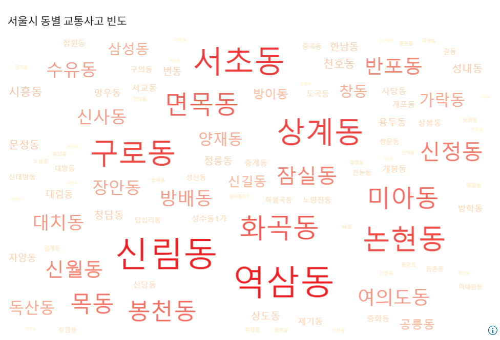

# 교통사고 유형별 위험구간 예측 및 분석
#### 팀원 : 김민영, 박연아, 옥수민
###### 자세한 설명 : sa133_분석결과보고서.pdf 참고

## 주제 
#### 교통사고 유형별 위험구간을 예측하고 사고원인이 되는 운전자형 로지스틱 회귀모형과 사고 유형별 로지스틱 회귀모형을 만들어 원인을 분석하고 해결방안 도출함.

## 데이터
#### 1. 교통사고데이터
#### 2. 디지털 운행 기록 데이터
#### 3. 교통 시설물 데이터 등 

## 언어 및 알고리즘
#### 언어 : SAS
#### 알고리즘 : Logistic Regression

## 데이터 탐색
### 1. 시간별 교통사고탐색
#### 발생 시간대별 사고유형 

### 2. 장소별 교통사고 
#### 서울시 동별 교통사고 텍스트마이닝

### 3. 피해자/가해자별 교통사고
#### 성별에 따른 가해자 연령대

## 데이터 분석
### 데이터 정제 
#### (1) 교통사고데이터 - 결측치/관측치 변환 및 제거, 새로운 파생변수 생성 
#### (2) DTG(운행기록)데이터 - 새로운 파생변수 생성, 데이터 분할(RPM 6000이상을 기록한 운전자 중 가장 높은 빈도를 가지는 운전자와 일반 운전자를 선정함.)

### 데이터 모델링
#### (1) 사고유형별 로지스틱 회귀 : 교통사고 유형을 결정하는 요인 찾기 위해 실시함.
#### 반응변수 : type_A(사고유형) 차대 차/ 그 외 사고로 이진 로지스틱 회귀 실시 (차대차 사고 비율이 매우 높아 나머지 사고를 통합하여 실시함.)
#### 설명변수 : 고정요인 : 도로형태, 변동요인 : 사고내용, 가해운전자 차량, 평일/주말, 시간대, 계절, 가해운전자 연령대 (단계별 변수선택법 실시 (stepwise))
#### 설명변수 수준해석 : 
#### 계절 : 차대차 사고는 여름일 경우 사고 비율이 높고 겨울일 때 낮다. -> 겨울에는 차대차 사고보다 미끄러운 노면 상태의 의한 차량 단독 사고나 차대 사람 사고가 발생할 확률이 높다. 
#### 시간대 : 출근시간에는 회사 밀집구역에 차가 몰려 접촉사고나 충돌 사고등 차대차 사고 발생 비율이 높음. 주거 지역으로 흩어지는 퇴근시간에는 비교적 차대차 사고가 날 확률이 높지 않을 것으로 예측함.
#### 가해 운전자 연령대 : 운전 경험이 적은 초년층과 신체적 노화로 영향을 줄 수 있는 노년층이 차대차 사고낼 확률이 높다. 

#### (2) DTG 위험 운전자 로지스틱 회귀분석 : 위험운전행동을 하는 운전자 결정하는 요인을 찾기위해 실시함.
#### 반응변수 : rpm을 기준으로 위험운전자/일반운전자 구분함.
#### 설명변수 : 브레이크 신호, 전방 가속도, 후방가속도, 우측가속도, 좌측가속도 등
#### 설명변수 수준해석 : 차선변경을 하거나 직진하는 단일로에서 크게 가속하는 행동은 운전자의 태도를 결정하는 중요한 요인임. 

### 지역별 사고 다발 구역 분석 

## 해결방안
### 차대차 교차로 교통사고 분석
#### 문제점 : 충돌사고 많이 발생함. -> 교차로 진입 우선권 정보 미흡, 교차로 차선 구별 상태 미흡 등
#### 방안 : 신호등 밑 표지판 대신 신속한 정보 인지를 위한 전광판 설치, 꼬리물기나 과속방지를 위한 단속카메라 설치

### 지역별 사고 다발구역 교통사고 분석 
#### 방안 : 규칙적 횡단보도 설치, 교차지점 표지판 설치 
