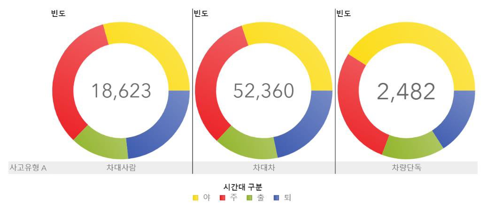

# 교통사고 유형별 위험구간 예측 및 분석
#### 팀원 : 김민영, 박연아, 옥수민
###### 자세한 설명 : sa133_분석결과보고서.pdf 참고

## 주제 
#### 교통사고 유형별 위험구간을 예측하고 사고원인이 되는 운전자형 로지스틱 회귀모형과 사고 유형별 로지스틱 회귀모형을 만들어 원인을 분석하고 해결방안 도출함.

## 데이터
#### 1. 교통사고데이터
#### 2. 디지털 운행 기록 데이터
#### 3. 교통 시설물 데이터 등 

## 언어 및 알고리즘
#### 언어 : SAS
#### 알고리즘 : Logistic Regression

## 데이터 탐색
### 1. 시간별 교통사고탐색
#### 발생 시간대별 사고유형 

### 2. 장소별 교통사고 
#### 서울시 동별 교통사고 텍스트마이닝
![img] 

### 3. 피해자/가해자별 교통사고
#### 성별에 따른 가해자 연령대
!img] 

